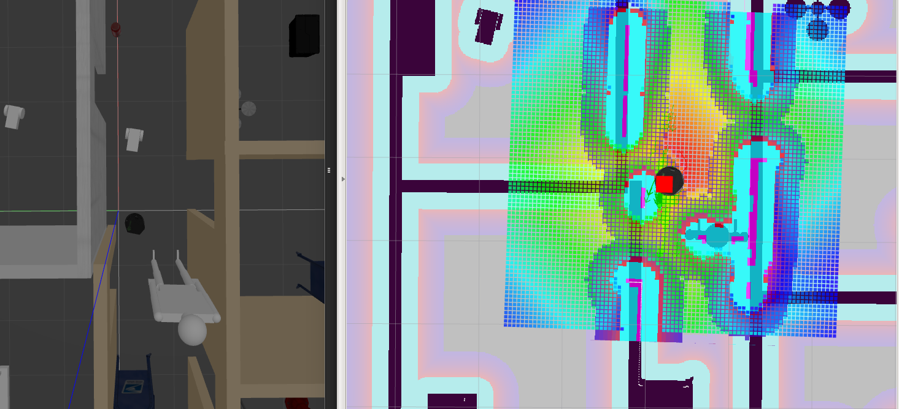

# home_service_robot

ROS package of a robot capable of performing path planning and navigation.

This robot can autonomously map an environment and navigate to pickup and drop virtual objects.

It contains already existing ROS packages as submodules

* gmapping
* turtlebot_teleop
* turtlebot_rviz_launchers
* turtlebot_gazebo
* [pick_objects](https://github.com/danibyay/pick_objects)
* [add_markers](https://github.com/danibyay/add_markers)

# Download

`git clone --recursive https://github.com/danibyay/home_service_robot`

# Usage

`catkin_make`

`source devel/setup.bash`

`chmod +x src/scrips/home_service.sh`

`./src/scripts/home_service.sh`

## Home service

This script is the complete project. It launches gazebo, rviz, amcl, pick_objects and add_markers.

## Add markers

To test only the markers being drawn and removed, move to the tag of the **add_markers** repo **test**

And run the script add_markers

`cd add_markers`

`git checkout test`

`./src/scripts/add_marker.sh`

## Pick objects

To test only the navigation goals for the robot you can run the script pick_objects

`./src/scripts/pick_objects.sh`

## Mapping and navigation

To test separately mapping and navigation you can run the following scripts respectively in the scripts folder.

`test_slam.sh`

`test_navigation.sh`

# Important!

You need to give execution permission to all the scripts that you want to run with

`chmod +x <path_to_script>`

# Screenshot

