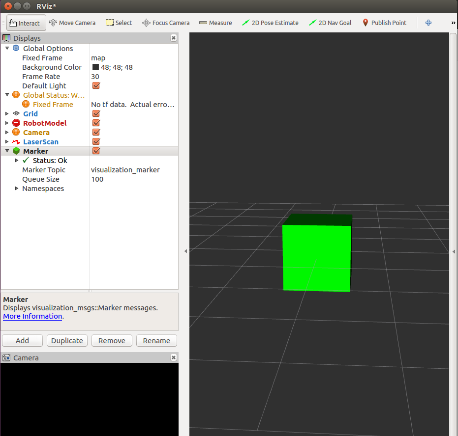

# add_markers
ROS package to create virtual objects in RViz

Based on [this tutorial](http://wiki.ros.org/rviz/Tutorials/Markers%3A%20Basic%20Shapes), virtual objects are marked in RViz to represent an object that will be picked up and then dropped off by a [home service robot](https://github.com/danibyay/home_service_robot)

# usage

`roslaunch add_markers add_markers.launch`

`rosrun rviz rviz`

1. Type `map` in the fixed_frame field in RViz.

2. Display > Add > Marker

# screenshot
Rviz showing a cubed green marker.

